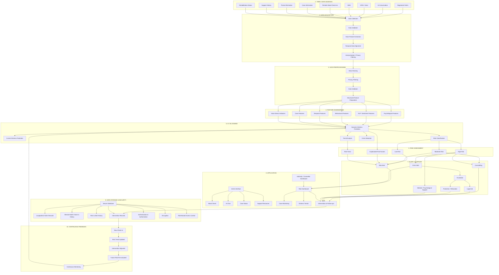
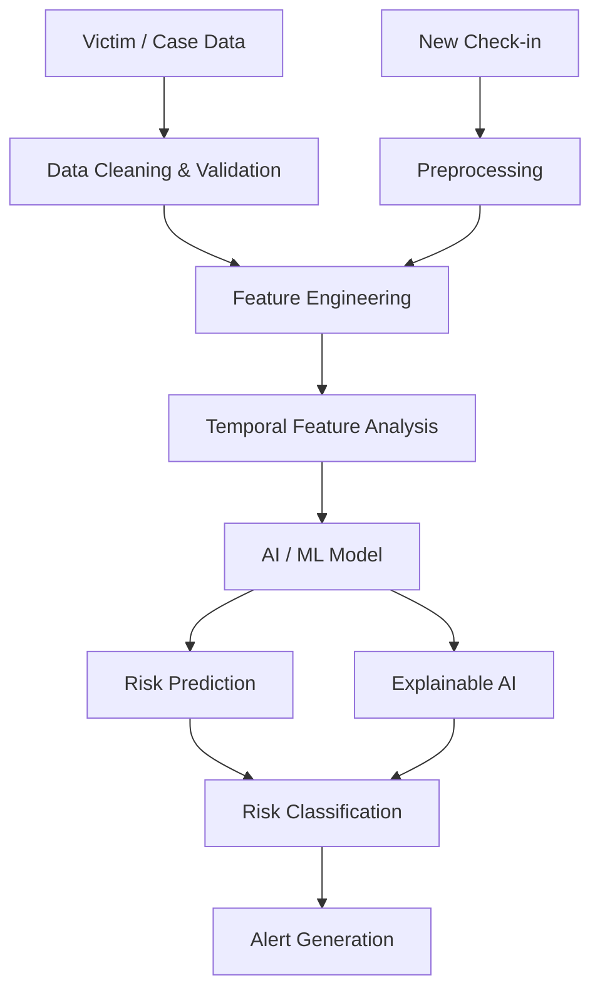
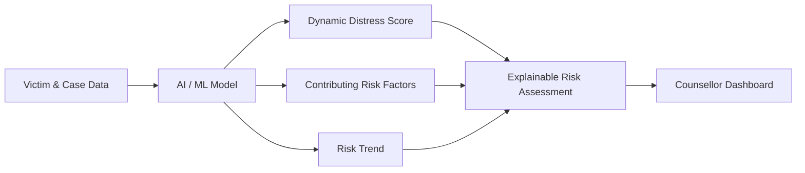
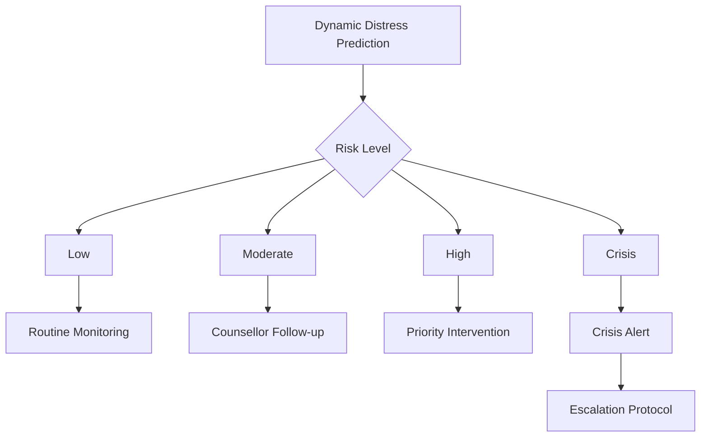
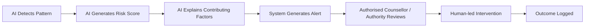
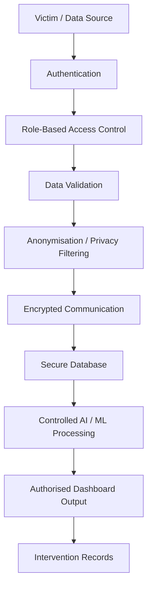
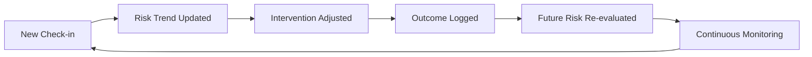

<h1>NIRBHAYMIND</h1>
<h3>AI-Powered Dynamic Mental Health Monitoring &amp; Distress Prediction System for Victims of Atrocities</h3>

  <b>“For all the battles you've won that nobody knows about.”</b>

  

 

-6A1B9A?style=flat-square)

## Problem Statement

Victims of atrocities may experience prolonged psychological distress due to repeated court dates, legal delays, threats, social isolation, uncertainty, and other challenges throughout the legal and rehabilitation process.

Conventional support mechanisms may depend heavily on victims explicitly reporting that they are distressed. However, victims may be unwilling or unable to repeatedly describe their emotional state because of fear, exhaustion, reluctance, or lack of trust.

Existing support mechanisms can provide legal aid and compensation, but may not continuously monitor changes in mental wellbeing between major case milestones.

The proposed system uses **Artificial Intelligence, Natural Language Processing, behavioural analysis, voice analysis, and longitudinal monitoring to identify changing patterns associated with victim distress**, providing early-warning information and connecting victims with appropriate human-led support.

---

# Proposed Solution

NirbhayMind integrates victim information, wellbeing check-ins, behavioural signals, case information, threat information, and support history into a secure analytical pipeline.

The system:

* Collects information through a multilingual AI chatbot, IVRS, SMS, and mood check-ins
* Validates and preprocesses incoming information
* Applies anonymisation and privacy filtering
* Extracts psychological, linguistic, behavioural, and temporal features
* Analyses sentiment, emotion, speech patterns, and engagement behaviour
* Combines current and historical information to identify distress trajectories
* Generates a **Dynamic Distress Score**
* Classifies the current risk level
* Identifies contributing factors using explainable AI
* Generates early-warning and crisis alerts
* Recommends appropriate support such as counselling, legal aid, protection, relocation, or medical/psychological support
* Enables authorised counsellors and authorities to monitor cases
* Continuously evaluates changes after intervention

The system is designed as a **support and early-warning mechanism**, where AI assists authorised human personnel rather than replacing human-led intervention.

---

# Solution Architecture

---

# System Workflow

The system follows a continuous pipeline from victim interaction and data collection to distress prediction, risk assessment, human intervention, and future risk re-evaluation.

```mermaid
flowchart LR

    C["Victim / Data Collection"]
    P["Preprocessing"]
    F["Feature Extraction"]
    T["Temporal Analysis"]
    M["AI / ML Prediction"]
    R["Risk Classification"]
    X["Explainable Risk Factors"]
    A["Early-Warning / Crisis Alert"]
    H["Human Review"]
    S["Support Recommendation"]
    I["Intervention"]
    L["Outcome Logging"]
    M2["Continuous Monitoring"]

    C --> P
    P --> F
    F --> T
    T --> M
    M --> R
    R --> X
    X --> A
    A --> H
    H --> S
    S --> I
    I --> L
    L --> M2
    M2 --> T
```

### Workflow Stages

| Stage                      | Function                                                                          |
| -------------------------- | --------------------------------------------------------------------------------- |
| **Data Collection**        | Collect case, wellbeing, mood, behavioural, voice, threat and support information |
| **Preprocessing**          | Validate, clean, anonymise and privacy-filter incoming data                       |
| **Feature Extraction**     | Extract psychological, linguistic, behavioural, temporal and case features        |
| **Temporal Analysis**      | Compare current signals with previous assessments and trends                      |
| **AI/ML Prediction**       | Generate the Dynamic Distress Score and identify risk patterns                    |
| **Risk Classification**    | Categorise the current risk level                                                 |
| **Explainability**         | Identify major factors contributing to the detected risk                          |
| **Early Warning**          | Generate risk or crisis alerts when concerning patterns emerge                    |
| **Human Review**           | Allow counsellors or authorised personnel to assess the case                      |
| **Support Recommendation** | Connect the victim with appropriate support                                       |
| **Intervention**           | Provide counselling, legal, protection, relocation or medical support             |
| **Continuous Monitoring**  | Track subsequent changes and re-evaluate future risk                              |

---

# AI / ML Component

The AI/ML layer forms the predictive core of NirbhayMind.

It combines information from multiple modalities and analyses both the **current state** and the **trajectory of distress over time**.

The system considers:

| Feature Category    | Examples                                                      |
| ------------------- | ------------------------------------------------------------- |
| **Psychological**   | Mood, stress, anxiety, sleep, emotional state                 |
| **Linguistic**      | Sentiment, emotion, word-choice and language patterns         |
| **Behavioural**     | Interaction frequency, skipped check-ins, shortened responses |
| **Temporal**        | Previous distress score, distress change, trajectory          |
| **Case Factors**    | Threat count, threat severity, case stage, delays             |
| **Support Factors** | Protection status, support history, rehabilitation status     |
| **Voice**           | Speech patterns and voice-stress indicators                   |

These features are combined to create a **Dynamic Distress Score** rather than evaluating each channel independently.

### Machine Learning Pipeline

The project proposal describes dynamic distress prediction, current distress prediction, risk classification, trend analysis, and crisis detection as the major functions of the AI/ML engine.

---

# Risk Classification

NirbhayMind categorises detected distress into understandable risk levels.

| Risk Level   | System Interpretation                       | Possible System Response             |
| ------------ | ------------------------------------------- | ------------------------------------ |
| **Low**      | Low current distress indicators             | Continue routine monitoring          |
| **Moderate** | Indicators suggest increasing concern       | Counsellor follow-up                 |
| **High**     | Significant distress or rising-risk pattern | Priority intervention                |
| **Crisis**   | Critical pattern requiring escalation       | Crisis alert and escalation protocol |

---

# Explainable AI

A risk prediction should not be presented as an unexplained number.

NirbhayMind therefore includes an explainability layer that surfaces the factors contributing to the detected risk.

### Example Output

| Output                  | Example                              |
| ----------------------- | ------------------------------------ |
| **Risk Level**          | High                                 |
| **Risk Trend**          | Increasing                           |
| **Contributing Factor** | Increased negative sentiment         |
| **Contributing Factor** | Reduced engagement                   |
| **Contributing Factor** | Increasing threat severity           |
| **Contributing Factor** | Significant case delay               |
| **Suggested Support**   | Counselling / Protection / Legal Aid |

The project specifically describes explainable AI as a mechanism through which counsellors can see the major contributing factors behind a changing risk score.

---

# Early-Warning System

The system is designed to identify **rising distress trends before they escalate into a crisis**, enabling earlier and more appropriate support.

---

# Human-in-the-Loop

Human oversight is a central part of the NirbhayMind architecture.

The AI system provides risk information and recommendations, while counsellors and authorised support personnel remain responsible for interpreting the situation and determining the appropriate intervention.

---

# Application Modules

| Module                      | Purpose                                                           |
| --------------------------- | ----------------------------------------------------------------- |
| **Victim Interface**        | Provide access to mood checks, AI chat, case status and resources |
| **AI Chatbot**              | Enable multilingual conversational interaction                    |
| **Mood Check-in**           | Capture quick wellbeing signals                                   |
| **IVRS / SMS**              | Enable accessible non-web interaction                             |
| **Risk Analysis**           | Generate dynamic distress and risk indicators                     |
| **Explainability**          | Display contributing risk factors                                 |
| **Risk Dashboard**          | Allow authorised personnel to monitor risk                        |
| **Case Monitoring**         | Track victim cases and relevant information                       |
| **Distress Trends**         | Visualise changes in distress over time                           |
| **Intervention Management** | Manage counselling, legal, protection and support actions         |
| **Follow-up Scheduling**    | Support continued monitoring                                      |
| **Support Resources**       | Provide access to relevant assistance                             |

---

# Privacy & Security

Victim mental-health and case information can be highly sensitive. NirbhayMind therefore follows a **Privacy by Design** approach.

### Security Measures

* Authentication and authorisation
* Role-Based Access Control
* Anonymisation
* Privacy filtering
* Encrypted communication
* Secure database
* Controlled access to victim records
* Secure intervention records
* Protection of sensitive information

The proposed architecture explicitly includes authentication, authorisation, encryption, anonymisation and role-based access control.

---

# Technology Stack

| Layer                | Technology / Tool                 |
| -------------------- | ---------------------------------- |
| **Frontend**         | React + Vite                       |
| **Backend**          | Node.js + Express                  |
| **AI / ML**          | Google Gemini API                  |
| **Database**         | Google Sheets(CSV) + JSON          |
| **Security**         | CORS Configuration, Environment Variables, Server-side API Key Protection     |
| **Authentication**   | Backend Credential Validation      |
| **Deployment**       | Vercel & Render                    |
| **Version Control**  | GitHub                             |

---

# Continuous Monitoring

NirbhayMind is designed around longitudinal monitoring rather than one-time assessment.

This feedback loop allows the system to continuously incorporate new check-ins, intervention outcomes, and changing distress trajectories.

---

# Impact & Benefits

| Benefit                         | Description                                                     |
| ------------------------------- | --------------------------------------------------------------- |
| **Early Identification**        | Detect rising distress before it reaches a crisis point         |
| **Improved Continuity of Care** | Keep victims connected to support between case milestones       |
| **Enhanced Access to Support**  | Connect victims with relevant assistance                        |
| **Reduced Isolation**           | Maintain support throughout the legal process                   |
| **Data-Backed Rehabilitation**  | Use longitudinal information to understand rehabilitation needs |
| **Fewer Crisis Incidents**      | Enable earlier intervention                                     |
| **Better Case Monitoring**      | Give authorised personnel a clearer view of distress trends     |
| **Personalised Support**        | Match detected needs with appropriate interventions             |

The proposed impact areas include reduced isolation, early identification of risk, improved continuity of care, enhanced access to support, fewer crisis incidents, and data-backed rehabilitation planning.

---

# Feasibility & Viability

NirbhayMind is designed around established AI/ML and NLP approaches rather than requiring experimental research.

The proposal identifies the following feasibility considerations:

* Uses established AI/ML and NLP techniques
* Combines chatbot, IVRS, mood-check and case inputs
* Supports secure deployment environments
* Uses anonymisation and encryption
* Uses role-based access control
* Can be introduced gradually through a district-level pilot
* Supports earlier intervention
* Can help prioritise cases requiring attention
* Can integrate with existing support structures
* Uses continuous feedback for model refinement

---

# Future Scope

The system can be extended through:

* Voice-based support in additional regional languages
* Optional wearable or biometric integration with explicit consent
* Personalised risk models adapted to individual baselines
* Expansion to other victim-support schemes
* Extension beyond the SC/ST Act
* Long-term rehabilitation tracking
* Longitudinal outcome analysis
* Broader deployment across government support departments

These extensions are identified in the project's proposed future scope.

---

# Research & References

The NirbhayMind proposal references research and resources related to:

* AI language analysis for PTSD trajectories
* Explainable AI for mental-health risk prediction
* Emotion-aware mental-health chatbots
* AI chatbots for survivors of harassment
* AI systems for vulnerable populations
* SC/ST (Prevention of Atrocities) Act, 1989
* National Helpdesk for Prevention of Atrocities — **14566**
* Dr. Ambedkar National Relief to SC/ST Victims of Atrocities Scheme
* NLP-based mental-health crisis detection and intervention
* Related research in AI-assisted mental-health monitoring

---

# Conclusion

NirbhayMind provides an AI-assisted approach to victim mental-health monitoring by combining **multichannel data collection, NLP, voice analysis, behavioural signals, longitudinal trends, dynamic distress prediction, explainable AI, early-warning alerts, and human-led intervention**.

Rather than relying on a single response or waiting for a visible crisis, the system continuously analyses changing patterns and connects detected needs with appropriate support.

The overall approach can be summarised as:

> **Collect signals → Protect privacy → Understand patterns → Track distress trajectory → Predict risk → Explain why → Alert early → Enable human intervention → Monitor continuously.**

---

###  NIRBHAYMIND

  
**Team: Main Characters**

